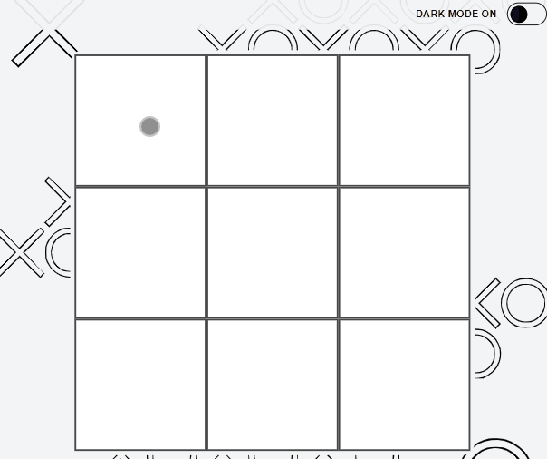

# Tic Tac Toe Game with React

This project was bootstrapped with [Create React App](https://github.com/facebook/create-react-app).

 - Author: Patryk Krawczyk
 - Created: 04.04.2022

## Prewiew and demo

Here you can find --> [**Demo**](https://kraviecdev.github.io/tic-tac-toe/) 

## Technologies used in project

- `HTML`
- `BEM`
- `CSS`
- `Flex/Grid`
- `Transition`
- `Media query`
- `JS/ES6+`
- `Immiutability`
- `Babel`
- `React`
- `Styled Components`
- `GlobalStyles & Theme`
- `useState`
- `useEffect`
- `Custom Hooks`

## Functions

1. Theme switch - dark/light
2. Player X -> Click square to mark your move
3. Player O -> Click square to mark your move
4. 3 **X** or 3 **O** in one line, including the bevel win a game.
5. If there is no winner, it is a draw
6. After result ***PLAY AGAIN*** clear the board
7. Have **FUN!!!** 

## Plan for future

1. Score board
2. Loading page
3. Possibility to play online
4. DB and API for saved scores

## Available Scripts

In the project directory, you can run:

### `npm start`

Runs the app in the development mode.\
Open [http://localhost:3000](http://localhost:3000) to view it in your browser.

The page will reload when you make changes.\
You may also see any lint errors in the console.

### `npm run build`

Builds the app for production to the `build` folder.\
It correctly bundles React in production mode and optimizes the build for the best performance.

The build is minified and the filenames include the hashes.\
Your app is ready to be deployed!

See the section about [deployment](https://facebook.github.io/create-react-app/docs/deployment) for more information.
